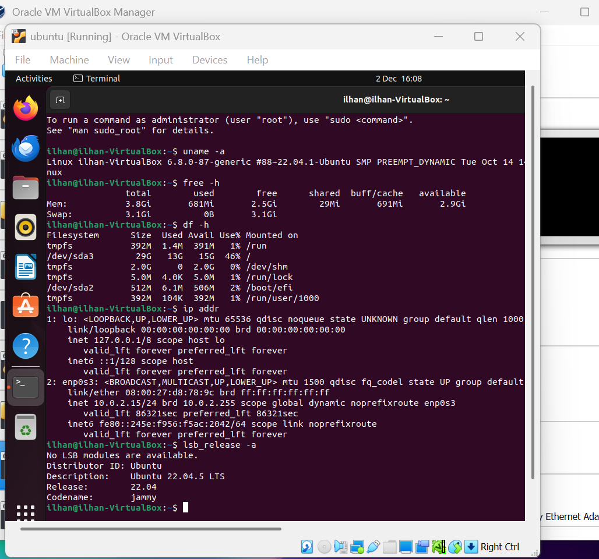

# Week 1 – System Planning and Distribution Selection

**CMPN202 Operating Systems Coursework**  
**Ilhan Mohamed – A00023555**

---

## Overview

Week 1 focuses on planning the dual VirtualBox setup, selecting an appropriate Linux server distribution, configuring the workstation environment, and collecting initial technical and network specifications for both virtual machines.

---

## 1. System Architecture Diagram

The diagram above shows how the Linux Mint workstation VM connects to the Ubuntu Server 22.04 VM using a VirtualBox Host-Only Network with SSH enabled for secure administration.

---

## 2. Distribution Selection Justification

**Chosen Server Distribution:** Ubuntu Server 22.04 LTS (Headless)

Ubuntu Server was selected due to its long-term support, strong documentation, and suitability for secure, SSH-only administration. Its lightweight nature makes it reliable within a VirtualBox environment, and it includes built-in security tools such as UFW and AppArmor.

**Alternatives considered:** Debian Server, Rocky Linux, AlmaLinux, CentOS Stream.

---

## 3. Workstation Configuration Decision

**Workstation Used:** Linux Mint Desktop VM

Linux Mint was chosen as the workstation operating system because it provides a full graphical interface, simple SSH connectivity, and a stable environment for monitoring, scripting, and managing the server VM.

---

## 4. Network Configuration Documentation

**VirtualBox Networking Mode:** Host-Only Network

A Host-Only Network was used to allow secure communication between the two virtual machines without exposing the server to external networks.

### Network Evidence

The screenshot above shows both virtual machines running simultaneously with their assigned IP addresses, confirming correct network configuration and connectivity.

---

## 5. System Specification Evidence

The following commands were executed on the Ubuntu Server VM to document system specifications:

- `uname -a`
- `free -h`
- `df -h`
- `ip addr`
- `lsb_release -a`

### Combined System Specification Output

All commands were run during a single session, and their outputs are visible in the screenshot above, confirming system details such as kernel version, memory allocation, storage usage, network interfaces, and OS release information.

