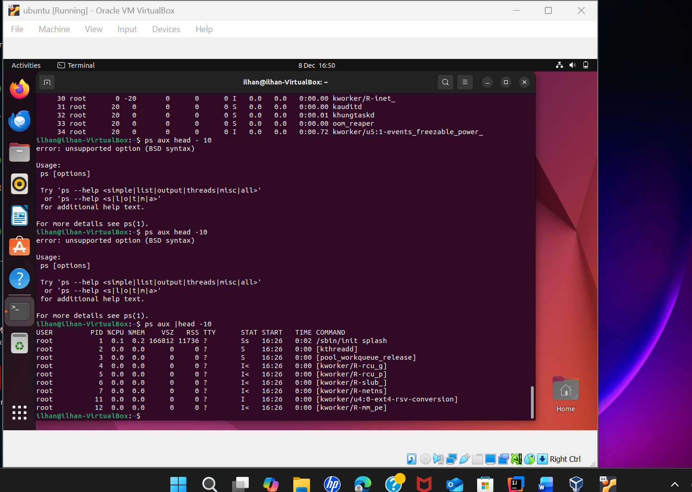

# Week 3 – Process and System Monitoring

**CMPN202 Operating Systems Coursework**  
**Ilhan Mohamed – A00023555**

---

## 📌 Overview

Week 3 focuses on monitoring system activity on the Ubuntu Server, including running processes, CPU usage, and system updates. The aim was to understand how Linux manages active processes and how administrators can monitor system performance in real time.

---

## 1️⃣ System Update and Package Management

To ensure the system was up to date, I ran system update commands using the APT package manager. This helps keep the server secure by applying the latest patches and updates.

This task demonstrated how Linux systems manage software updates centrally through repositories.

---

## 2️⃣ Viewing Running Processes with `ps aux`

The `ps aux` command was used to display all running processes on the system. This provided information such as process IDs (PID), CPU usage, memory usage, and the user running each process.

This is useful for identifying background services and troubleshooting performance issues.

---

## 3️⃣ Real-Time Process Monitoring with `top`

The `top` command was used to monitor system activity in real time. It shows live CPU usage, memory consumption, and active processes.

This allowed me to observe how system resources change dynamically and reinforced my understanding of Linux process scheduling.

---

## 🧠 Reflection

I initially found it difficult to interpret the amount of information shown by `ps aux` and `top`. However, after comparing outputs and researching key columns such as CPU and memory usage, I became more confident in understanding system performance data.

This week strengthened my understanding of how Linux handles multitasking and system monitoring.
