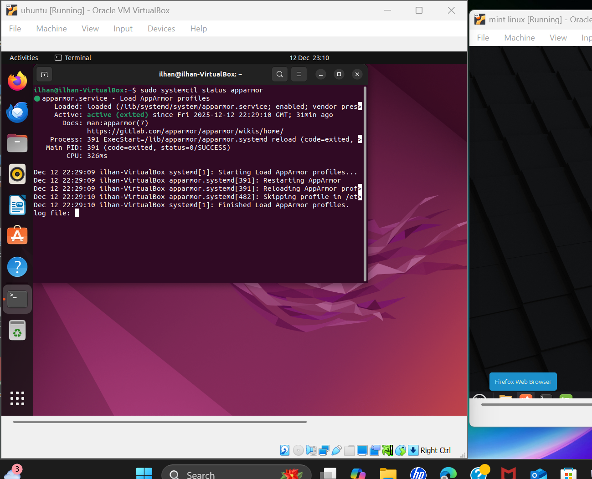

# Week 5 – Security and Monitoring

## Overview
This week focused on improving the security of the Ubuntu Server beyond basic firewall and SSH configuration. The main aim was to ensure the system was fully updated, network connectivity was functioning correctly, and mandatory access control was enforced using AppArmor. All configuration was completed on the Ubuntu Server via SSH, with verification carried out from the Linux Mint workstation, following the coursework requirement to use two systems.

## Network Configuration and Connectivity
The network configuration of the Ubuntu Server was checked using the `ip a` command to confirm that the correct network interfaces were active and assigned IP addresses. Connectivity was then tested by sending ICMP packets to an external address (8.8.8.8) using the `ping` command. Successful replies confirmed that the server had stable internet connectivity.

## System Updates
To reduce the risk of unpatched vulnerabilities, the system package lists were updated using `sudo apt update`. This ensured the server was aware of the latest available updates and security patches. Keeping the system up to date is a fundamental part of maintaining a secure operating system.

## AppArmor Configuration
AppArmor was enabled to provide mandatory access control on the Ubuntu Server. This limits what applications and services are permitted to access system resources, reducing the potential impact of security breaches. The `aa-status` command was used to confirm that AppArmor was active and that multiple profiles were loaded and enforcing correctly.

## Monitoring and Verification from Linux Mint
All configuration and security checks were verified from the Linux Mint workstation to confirm that the Ubuntu Server was reachable and functioning correctly from a separate client system. This demonstrated monitoring and validation from an external machine rather than locally on the server.

## Issues Encountered and Resolution
During the setup process, temporary network resolution issues were encountered, which resulted in errors when attempting to reach Ubuntu archive servers during updates. This was resolved by confirming network connectivity and re-running the update commands once connectivity was restored. This highlighted the importance of verifying network access before performing security updates.

## Reflection
This week significantly improved my understanding of practical Linux security management. Enabling AppArmor demonstrated how mandatory access control can reduce risk by restricting application behaviour. Verifying connectivity and updates reinforced the importance of maintaining a secure and monitored system. Troubleshooting network issues also improved my confidence in diagnosing and resolving real-world system problems.
