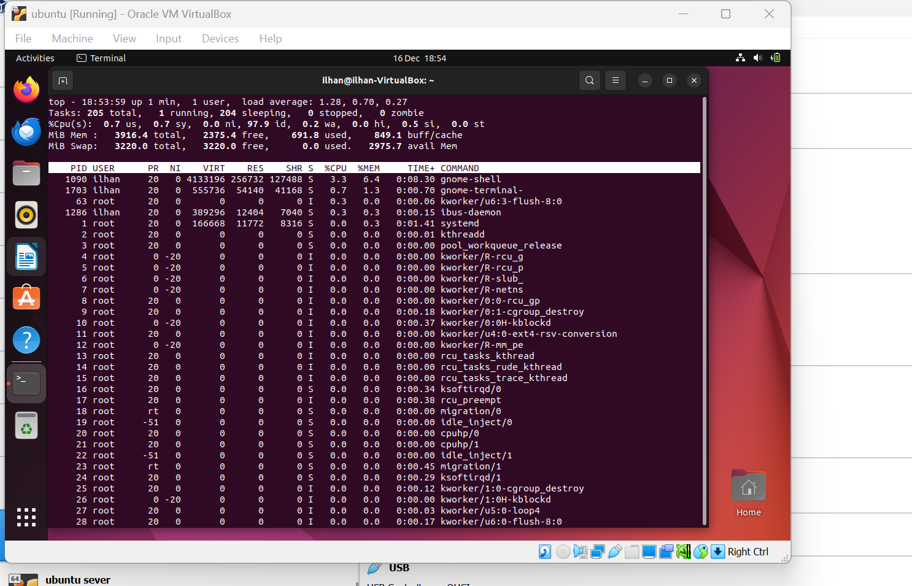

# Week 6 – Performance Evaluation and Analysis

CMPN202 Operating Systems Coursework  
Ilhan Mohamed – A00023555

---

## 📌 Overview

Week 6 focused on evaluating the performance of the Ubuntu Server under different workloads and analysing how the operating system behaves when system resources are stressed. The aim was to measure CPU usage, observe system behaviour under load, and identify potential bottlenecks. All performance testing was carried out on the Ubuntu Server via SSH, with monitoring performed in parallel to reflect real-world system administration practices.

---

## 🧪 Baseline Performance Testing

Before applying any workload, a baseline measurement was taken to understand how the system behaves under normal conditions. The `top` command was used to observe CPU usage, memory usage, and running processes while the system was idle. This baseline provided a reference point for comparison once stress testing was applied.

**Evidence – Baseline system state:**

---

## 🔥 CPU Load Testing

To simulate a CPU-intensive workload, the `stress` tool was used to generate sustained CPU load on the Ubuntu Server. This allowed observation of how the operating system schedules processes and manages CPU resources under pressure.

**Evidence – CPU load generation:**

---

## 📊 Performance Monitoring and Observation

While the stress test was running, system performance was monitored in real time using `top` in a separate terminal session. CPU usage increased significantly during the stress test and returned to normal once the workload ended, demonstrating effective process scheduling and resource management.

**Evidence – Real-time monitoring:**

---

## 🖥️ Monitoring from Linux Mint

Monitoring and verification were also carried out from the Linux Mint workstation to confirm that the Ubuntu Server remained accessible and responsive during testing. This demonstrated monitoring from an external client rather than directly on the server console.

**Evidence – Mint to Ubuntu monitoring:**

---

## 🧠 Analysis and Findings

The results showed that the Ubuntu Server handled CPU-intensive workloads effectively. CPU utilisation increased as expected during stress testing while system stability was maintained. Once the workload ended, the system returned to baseline performance levels, indicating efficient resource management and scheduling by the operating system.

---

## 📝 Reflection

Week 6 improved my understanding of how operating systems behave under performance stress and how to analyse this using command-line tools. Running stress tests alongside real-time monitoring clearly demonstrated the relationship between workload and system resource usage. This task also strengthened my confidence in performance evaluation and system analysis in real-world administration scenarios.
